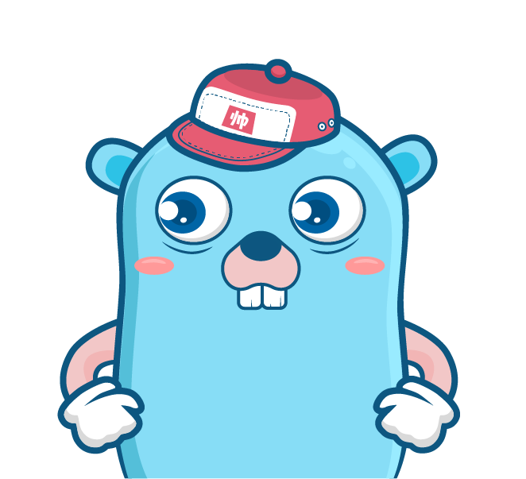

# Handsome boy 👋

# Introduction 🍍

Full Stack Developer 🍒

PM (Project Manager) 🚀

Micro Services Architecture, DevOps, CICD, BackEnd, FrontEnd... 🤓

Open Source Project Maintainer [vbeats](https://github.com/vbeats) 🍉

😯😯😯🚀🚀🚀💥💥💥⭕️⭕️❌❌ 

